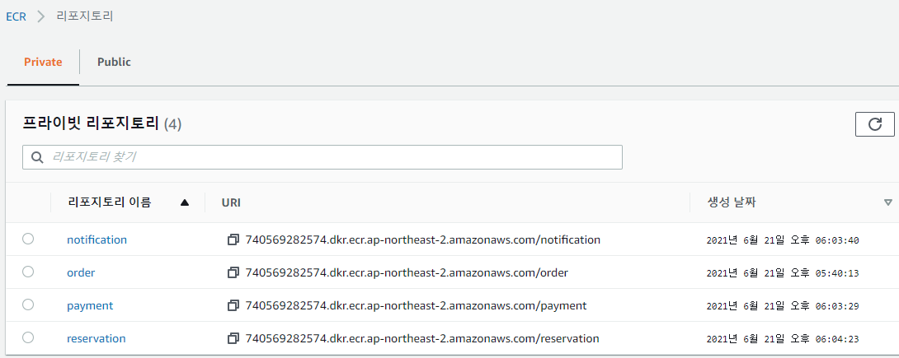

# [ 건강검진 예약 ]

Final Project AWS 3차수 - 1팀 제출자료입니다. 


# Table of contents

- [건강검진예약](#---)
  - [서비스 시나리오](#시나리오)
  - [분석/설계](#분석-설계)
  - [구현:](#구현)
    - [DDD 의 적용](#ddd-의-적용)
    - [폴리글랏 퍼시스턴스](#폴리글랏-퍼시스턴스)
    - [폴리글랏 프로그래밍](#폴리글랏-프로그래밍)
    - [Correlation](#Corrlation)                         
    - [동기식 호출 과 Fallback 처리](#동기식-호출-과-Fallback-처리)       
    - [비동기식 호출 과 Eventual Consistency](#비동기식-호출--시간적-디커플링--장애격리--최종-eventual-일관성-테스트)
    - [API Gateway](#API-게이트웨이-(gateway))                            
    - [SAGA-CQRS](#마이페이지)   
    -                      
  - [운영](#운영)
    - 컨테이너 이미지 생성 및 배포(#컨테이너-이미지-생성-및-배포) 
    - [동기식 호출 / Circuit Breaker](#동기식-호출--Circuit-Breaker) 
    - [오토스케일 아웃](#오토스케일-아웃)
    - [무정지 재배포(Readiness Probe)](#무정지-배포(Readiness-Probe))
    - [Self Healing(Liveness Probe)](#Self-Healing(Liveness-Probe))
    - [ConfigMap / Persistence Volume](#Config-Map/Persistence-Volume) 


## 시나리오

건강검진 예약 시스템에서 요구하는 기능/비기능 요구사항은 다음과 같습니다. 
사용자가 건강검진 예약 시 결제를 진행하면
검진센터 관리자가 예약을 확정하는 시스템입니다.
사용자는 진행상황을 확인할 수 있고, SMS로도 예약상태가 전송된다. 


#### 기능적 요구사항

1. 고객이 원하는 일자를 선택하고 예약한다.
2. 고객이 결제를 진행한다.
3. 예약이 신청 되면 신청내역이 검진센터에 전달된다. 
4. 검진센터 관리자가 신청내역을 확인하여 예약을 확정한다. 
5. 고객이 예약을 취소할 수 있다.
6. 예약이 취소 되면 검진 예약이 취소 된다.
7. 예약이 취소 되면 결제도 취소된다.
8. 고객이 예약 취소를 하면 예약 정보는 삭제 상태로 갱신 된다.
9. 고객이 예약 진행상태를 원할 때마다 조회한다.
10. 예약 상태가 변경되면 SMS로 알림이 발송된다.


#### 비 기능적 요구사항

1. 트랜잭션
   - 결제가 되지 않으면 검진예약 신청이 처리되지 않아야 한다. `Sync 호출`
   - 예약이 취소되면 결제도 취소가 되어야 한다. `Sync 호출`

2. 장애격리
   - 검진센터관리자 기능이 수행 되지 않더라도 예약은 365일 24시간 받을 수 있어야 한다. `Pub/Sub`
   - 결제 시스템이 과중되면 사용자를 잠시동안 받지 않고 결제를 잠시후에 하도록 유도 한다.
     (장애처리)

3. 성능
   - 고객이 예약 확인 상태를 마이페이지에서 확인할 수 있어야 한다. `CQRS`
   - 예약 상태가 바뀔 때 마다 SMS로 알림이 발송되어야 한다.


# 분석 설계

## Event Storming

#### ver1 - 이벤트도출
 - MSAEZ 툴에서 이벤트스토밍 작업
 - 업무별 담당자를 분배하여 각 도메인별 command,event,aggregate,policy를 도출
 - 이후 java소스로의 컨버전을 고려하여 네이밍을 영문 대문자로 시작하는 것으로 명칭변경 적용


#### ver2 - relation정의


#### ver3 - attribute생성


### 기능 요구사항을 커버하는지 검증
1. 고객이 원하는 일자를 선택하고 예약한다.  --> O
2. 고객이 결제를 진행한다.  --> O
3. 예약이 신청 되면 신청내역이 검진센터에 전달된다.   --> O
4. 검진센터 관리자가 신청내역을 확인하여 예약을 확정한다.   --> O
5. 고객이 예약을 취소할 수 있다.  --> O
6. 예약이 취소 되면 검진 예약이 취소 된다.  --> O
7. 예약이 취소 되면 결제도 취소된다.  --> O
8. 고객이 예약 취소를 하면 예약 정보는 삭제 상태로 갱신 된다.  --> O
9. 고객이 예약 진행상태를 원할 때마다 조회한다.  --> O
10. 예약 상태가 변경되면 SMS로 알림이 발송된다.  --> O


### 비기능 요구사항을 커버하는지 검증

1. 트랜잭션
   - 결제가 되지 않으면 검진예약 신청이 처리되지 않아야 한다. `Sync 호출` --> O
   - 예약이 취소되면 결제도 취소가 되어야 한다. `Sync 호출` --> O
   ==>  Request-Response 방식 처리
   
2. 장애격리
   - 검진센터관리자 기능이 수행 되지 않더라도 예약은 365일 24시간 받을 수 있어야 한다. `Pub/Sub` --> O
   ==>  Pub/Sub 방식으로 처리(Pub/Sub)
   - 결제 시스템이 과중되면 사용자를 잠시동안 받지 않고 결제를 잠시후에 하도록 유도 한다.
     (장애처리)

3. 성능
   - 고객이 예약 확인 상태를 마이페이지에서 확인할 수 있어야 한다. `CQRS`
   - 예약 상태가 바뀔 때 마다 SMS로 알림이 발송되어야 한다.


## 구현
분석/설계 단계에서 도출된 헥사고날 아키텍처에 따라, 각 BC별로 대변되는 마이크로 서비스들을 스프링부트로 구현.
각 서비스 별로 포트넘버 부여 확인 ( 8081 ~ 8084 )

### 포트넘버 분리
```
spring:
  profiles: default
  cloud:
    gateway:
      routes:
        - id: order
          uri: http://localhost:8081
          predicates:
            - Path=/orders/** 
        - id: reservation
          uri: http://localhost:8082
          predicates:
            - Path=/reservations/**,/cancellations/** 
        - id: payment
          uri: http://localhost:8083
          predicates:
            - Path=/paymentHistories/** 
        - id: customer
          uri: http://localhost:8084
          predicates:
            - Path= /mypages/**
```

### 각 서비스를 수행
```
cd /home/project/health_center/order
mvn spring-boot:run

cd /home/project/health_center/payment
mvn spring-boot:run

cd /home/project/health_center/reservation
mvn spring-boot:run

cd /home/project/health_center/notification
mvn spring-boot:run

netstat -anlp | grep :808
```

## DDD 의 적용

- 각 서비스내에 도출된 핵심 Aggregate Root 객체를 Entity 로 선언하였다: 
- (예시는 order 마이크로 서비스).
```
package healthcenter;

import javax.persistence.*;
import org.springframework.beans.BeanUtils;

import healthcenter.external.PaymentHistory;

@Entity
@Table(name="Order_table")
public class Order {

    @Id
    @GeneratedValue(strategy=GenerationType.AUTO)
    private Long id;
    private String orderType;
    private Long cardNo;
    private String name;
    private String status;

    @PostPersist
    public void onPostPersist(){
        Ordered ordered = new Ordered();
        BeanUtils.copyProperties(this, ordered);
        ordered.publishAfterCommit();

        //Following code causes dependency to external APIs
        // it is NOT A GOOD PRACTICE. instead, Event-Policy mapping is recommended.

        PaymentHistory payment = new PaymentHistory();
        System.out.println("this.id() : " + this.id);
        payment.setOrderId(this.id);
        payment.setStatus("Reservation OK");
        // mappings goes here
        OrderApplication.applicationContext.getBean(healthcenter.external.PaymentHistoryService.class)
            .pay(payment);


    }

    @PostUpdate
    public void onPostUpdate(){
    	System.out.println("Order Cancel  !!");
        OrderCanceled orderCanceled = new OrderCanceled();
        BeanUtils.copyProperties(this, orderCanceled);
        orderCanceled.publishAfterCommit();


    }


    public Long getId() {
        return id;
    }

    public void setId(Long id) {
        this.id = id;
    }
    public String getOrderType() {
        return orderType;
    }

    public void setOrderType(String orderType) {
        this.orderType = orderType;
    }
    public Long getCardNo() {
        return cardNo;
    }

    public void setCardNo(Long cardNo) {
        this.cardNo = cardNo;
    }


    public String getName() {
        return name;
    }

    public void setName(String name) {
        this.name = name;
    }
    public String getStatus() {
        return status;
    }

    public void setStatus(String status) {
        this.status = status;
    }

}

```

- Entity Pattern 과 Repository Pattern 을 적용하여 JPA 를 통하여 다양한 데이터소스 유형 (RDB or NoSQL) 에 대한 별도의 처리가 없도록 
데이터 접근 어댑터를 자동 생성하기 위하여 Spring Data REST 의 RestRepository 를 적용하였다
```
package healthcenter;

import org.springframework.data.repository.PagingAndSortingRepository;

public interface OrderRepository extends PagingAndSortingRepository<Order, Long>{
}
```

- 적용 후 REST API 의 테스트
```
# app 서비스의 주문처리
http localhost:8081/orders orderType=basic

# pay 서비스의 결제처리
http localhost:8083/paymentHistories orderId=1 price=50000 payMethod=card

# reservation 서비스의 예약처리
http localhost:8082/reservations orderId=1 status="confirmed"

# 주문 상태 확인(mypage)

http localhost:8081/orders/3
root@labs--1428063258:/home/project/healthcenter# http localhost:8084/mypages/1
HTTP/1.1 200 
Content-Type: application/hal+json;charset=UTF-8
Date: Mon, 21 Jun 2021 10:43:12 GMT
Transfer-Encoding: chunked

{
    "_links": {
        "mypage": {
            "href": "http://localhost:8084/mypages/1"
        },
        "self": {
            "href": "http://localhost:8084/mypages/1"
        }
    },
    "name": null,
    "orderId": 1,
    "reservationId": 3,
    "status": "confirmed"
}


```

## 폴리글랏 퍼시스턴스
비지니스 로직은 내부에 순수한 형태로 구현
그 이외의 것을 어댑터 형식으로 설계 하여 해당 비지니스 로직이 어느 환경에서도 잘 도작하도록 설계


폴리그랏 퍼시스턴스 요건을 만족하기 위해 기존 h2를 hsqldb로 변경

```
<!--		<dependency>-->
<!--			<groupId>com.h2database</groupId>-->
<!--			<artifactId>h2</artifactId>-->
<!--			<scope>runtime</scope>-->
<!--		</dependency>-->

		<dependency>
			<groupId>org.hsqldb</groupId>
			<artifactId>hsqldb</artifactId>
			<version>2.4.0</version>
			<scope>runtime</scope>
		</dependency>

# 변경/재기동 후 예약 주문
 http localhost:8081/orders orderType=basic name=woo
 
HTTP/1.1 201 
Content-Type: application/json;charset=UTF-8
Date: Mon, 21 Jun 2021 10:53:32 GMT
Location: http://localhost:8081/orders/2
Transfer-Encoding: chunked

{
    "_links": {
        "order": {
            "href": "http://localhost:8081/orders/2"
        },
        "self": {
            "href": "http://localhost:8081/orders/2"
        }
    },
    "cardNo": null,
    "name": "woo",
    "orderType": "basic",
    "status": null
}

# 저장이 잘 되었는지 조회

http localhost:8084/mypages/2

HTTP/1.1 200 
Content-Type: application/hal+json;charset=UTF-8
Date: Mon, 21 Jun 2021 10:55:04 GMT
Transfer-Encoding: chunked

{
    "_links": {
        "mypage": {
            "href": "http://localhost:8084/mypages/2"
        },
        "self": {
            "href": "http://localhost:8084/mypages/2"
        }
    },
    "name": "woo",
    "orderId": 2,
    "reservationId": 5,
    "status": "Reservation Complete"
}


```


## 동기식 호출 과 Fallback 처리

분석단계에서의 조건 중 하나로 주문(app)->결제(pay) 간의 호출은 동기식 일관성을 유지하는 트랜잭션으로 처리하기로 하였다. 호출 프로토콜은 이미 앞서 Rest Repository 에 의해 노출되어있는 REST 서비스를 FeignClient 를 이용하여 호출하도록 한다. 

- 결제서비스를 호출하기 위하여 Stub과 (FeignClient) 를 이용하여 Service 대행 인터페이스 (Proxy) 를 구현 
```
# (external) PaymentHistoryService.java

package healthcenter.external;

import org.springframework.cloud.openfeign.FeignClient;
import org.springframework.web.bind.annotation.RequestBody;
import org.springframework.web.bind.annotation.RequestMapping;
import org.springframework.web.bind.annotation.RequestMethod;

@FeignClient(name="payment", url="${api.payment.url}")
public interface PaymentHistoryService {

    @RequestMapping(method= RequestMethod.POST, path="/paymentHistories")
    public void pay(@RequestBody PaymentHistory paymentHistory);

}                      
```

- 주문을 받은 직후(@PostPersist) 결제를 요청하도록 처리
```
# Order.java (Entity)
    @PostPersist
    public void onPostPersist(){
        Ordered ordered = new Ordered();
        BeanUtils.copyProperties(this, ordered);
        ordered.publishAfterCommit();


        healthcenter.external.PaymentHistory paymentHistory = new healthcenter.external.PaymentHistory();

        PaymentHistory payment = new PaymentHistory();
        System.out.println("this.id() : " + this.id);
        payment.setOrderId(this.id);
        payment.setStatus("Reservation OK");
        // mappings goes here
        OrderApplication.applicationContext.getBean(healthcenter.external.PaymentHistoryService.class)
            .pay(payment);
    }
```

- 동기식 호출에서는 호출 시간에 따른 타임 커플링이 발생하며, 결제 시스템이 장애가 나면 주문도 못받는다는 것을 확인:
```
# 결제 (payment) 서비스를 잠시 내려놓음 (ctrl+c)

#주문처리
 http localhost:8081/orders orderType=prime name=jung

#Fail
HTTP/1.1 500 
Connection: close
Content-Type: application/json;charset=UTF-8
Date: Mon, 21 Jun 2021 12:45:45 GMT
Transfer-Encoding: chunked

{
    "error": "Internal Server Error",
    "message": "Could not commit JPA transaction; nested exception is javax.persistence.RollbackException: Error while committing the transaction",
    "path": "/orders",
    "status": 500,
    "timestamp": "2021-06-21T12:45:45.797+0000"
}


#결제서비스 재기동
cd /home/project/healthcenter/payment
mvn spring-boot:run

#주문처리
http localhost:8081/orders orderType=prime name=jung

#Success
HTTP/1.1 201 
Content-Type: application/json;charset=UTF-8
Date: Mon, 21 Jun 2021 12:47:48 GMT
Location: http://localhost:8081/orders/2
Transfer-Encoding: chunked

{
    "_links": {
        "order": {
            "href": "http://localhost:8081/orders/2"
        },
        "self": {
            "href": "http://localhost:8081/orders/2"
        }
    },
    "cardNo": null,
    "name": "jung",
    "orderType": "prime",
    "status": null
}
```

## 비동기식 호출 / 시간적 디커플링 / 장애격리 / 최종 (Eventual) 일관성 테스트

결제가 이루어진 후에 센터예약 시스템으로 이를 알려주는 행위는 동기식이 아니라 비 동기식으로 처리하여 
예약 시스템의 처리를 위하여 결제주문이 블로킹 되지 않도록 처리
 
- 이를 위하여 결제이력에 기록을 남긴 후에 곧바로 결제승인이 되었다는 도메인 이벤트를 카프카로 송출한다(Publish)
 
```
#PaymentHistory.java

package healthcenter;

import javax.persistence.*;
import org.springframework.beans.BeanUtils;
import java.util.List;

@Entity
@Table(name="PaymentHistory_table")
public class PaymentHistory {

...
    @PostPersist
    public void onPostPersist(){
        PaymentApproved paymentApproved = new PaymentApproved();
        paymentApproved.setStatus("Pay Approved!!");
        BeanUtils.copyProperties(this, paymentApproved);
        paymentApproved.publishAfterCommit();
    }
```

- 예약서비스에서는 결제승인 이벤트에 대해서 이를 수신하여 자신의 정책을 처리하도록 PolicyHandler 를 구현한다.

```
# (reservation) PolicyHandler.java

package healthcenter;

import healthcenter.config.kafka.KafkaProcessor;
import com.fasterxml.jackson.databind.DeserializationFeature;
import com.fasterxml.jackson.databind.ObjectMapper;
import org.springframework.beans.factory.annotation.Autowired;
import org.springframework.cloud.stream.annotation.StreamListener;
import org.springframework.messaging.handler.annotation.Payload;
import org.springframework.stereotype.Service;

@Service
public class PolicyHandler{

    @Autowired
    private ReservationRepository reservationRepository;
	
    @StreamListener(KafkaProcessor.INPUT)
    public void onStringEventListener(@Payload String eventString){

    }

    @StreamListener(KafkaProcessor.INPUT)
    public void wheneverPaymentApproved_(@Payload PaymentApproved paymentApproved){


        if(paymentApproved.isMe()){
            System.out.println("##### listener  : " + paymentApproved.toJson());
            Reservation reservation = new Reservation();
            reservation.setStatus("Reservation Complete");
            reservation.setOrderId(paymentApproved.getOrderId());
            reservationRepository.save(reservation);
            
        }
    }

}


```

예약시스템은 주문/결제와 완전히 분리되어있으며, 이벤트 수신에 따라 처리되기 때문에, 예약시스템이 유지보수로 인해 잠시 내려간 상태라도 예약 주문을 받는데 문제가 없어야 한다.

```
# (reservation)예약 서비스를 잠시 내려놓음 (ctrl+c)

# 주문처리
http localhost:8081/orders orderType=prime name=jung   #Success

# 결제처리
http localhost:8083/paymentHistories orderId=3 price=50000 payMethod=cash   #Success

# 주문 상태 확인
http localhost:8081/orders/3   

# 주문상태 안바뀜 확인
HTTP/1.1 200 
Content-Type: application/hal+json;charset=UTF-8
Date: Mon, 21 Jun 2021 12:57:53 GMT
Transfer-Encoding: chunked

{
    "_links": {
        "order": {
            "href": "http://localhost:8081/orders/3"
        },
        "self": {
            "href": "http://localhost:8081/orders/3"
        }
    },
    "cardNo": null,
    "name": "jung",
    "orderType": "prime",
    "status": null
}

# reservation 서비스 기동
cd /home/project/healthcenter/reservation
mvn spring-boot:run

# 주문상태 확인(mypage) : 주문 상태가 "Reservation Complete"으로 확인

HTTP/1.1 200 
Content-Type: application/hal+json;charset=UTF-8
Date: Mon, 21 Jun 2021 13:01:14 GMT
Transfer-Encoding: chunked

{
    "_links": {
        "mypage": {
            "href": "http://localhost:8084/mypages/5"
        },
        "self": {
            "href": "http://localhost:8084/mypages/5"
        }
    },
    "name": "jung",
    "orderId": 3,
    "reservationId": 2,
    "status": "Reservation Complete"
}
```

## API 게이트웨이(gateway)

API gateway 를 통해 MSA 진입점을 통일 시킨다.

```
# gateway 기동(8080 포트)
cd gateway
mvn spring-boot:run

# api gateway를 통한 prime 타입의 검진예약주문
http localhost:8080/orders orderType=prime name=jung

HTTP/1.1 201 
Content-Type: application/json;charset=UTF-8
Date: Mon, 21 Jun 2021 12:47:48 GMT
Location: http://localhost:8081/orders/2
Transfer-Encoding: chunked

{
    "_links": {
        "order": {
            "href": "http://localhost:8081/orders/2"
        },
        "self": {
            "href": "http://localhost:8081/orders/2"
        }
    },
    "cardNo": null,
    "name": "jung",
    "orderType": "prime",
    "status": null
}
```

```
application.yml

server:
  port: 8080

---
spring:
  profiles: default
  cloud:
    gateway:
      routes:
        - id: order
          uri: http://localhost:8081
          predicates:
            - Path=/orders/** 
        - id: reservation
          uri: http://localhost:8082
          predicates:
            - Path=/reservations/**,/cancellations/** 
        - id: payment
          uri: http://localhost:8083
          predicates:
            - Path=/paymentHistories/** 
        - id: notification
          uri: http://localhost:8084
          predicates:
            - Path= /mypages/**
      globalcors:
        corsConfigurations:
          '[/**]':
            allowedOrigins:
              - "*"
            allowedMethods:
              - "*"
            allowedHeaders:
              - "*"
            allowCredentials: true


---

spring:
  profiles: docker
  cloud:
    gateway:
      routes:
        - id: order
          uri: http://order:8080
          predicates:
            - Path=/orders/** 
        - id: reservation
          uri: http://reservation:8080
          predicates:
            - Path=/reservations/**,/cancellations/** 
        - id: payment
          uri: http://payment:8080
          predicates:
            - Path=/paymentHistories/** 
        - id: customer
          uri: http://customer:8080
          predicates:
            - Path= /mypages/**
      globalcors:
        corsConfigurations:
          '[/**]':
            allowedOrigins:
              - "*"
            allowedMethods:
              - "*"
            allowedHeaders:
              - "*"
            allowCredentials: true
            
logging:
  level:
    root: debug

server:
  port: 8080

```
## 마이페이지
# CQRS
- 고객이 예약건에 대한 Status를 조회할 수 있도록 CQRS로 구현하였음.
-  mypage 조회를 통해 모든 예약건에 대한 상태정보를 확인할 수 있음.

고객의 예약정보를 한 눈에 볼 수 있게 mypage를 구현 한다.(CQRS)

```
# mypage 호출 
http localhost:8084/mypages/2

HTTP/1.1 200 
Content-Type: application/hal+json;charset=UTF-8
Date: Mon, 21 Jun 2021 10:56:50 GMT
Transfer-Encoding: chunked

{
    "_links": {
        "mypage": {
            "href": "http://localhost:8084/mypages/2"
        },
        "self": {
            "href": "http://localhost:8084/mypages/2"
        }
    },
    "name": "woo",
    "orderId": 2,
    "reservationId": 6,
    "status": "Reservation Complete"
}
```
- 여러개의 리스트 
```{
    "_links": {
        "mypage": {
            "href": "http://localhost:8084/mypages/5"
        },
        "self": {
            "href": "http://localhost:8084/mypages/5"
        }
    },
    "name": "jung",
    "orderId": 3,
    "reservationId": 2,
    "status": "Reservation Complete"
},
{
    "_links": {
        "mypage": {
            "href": "http://localhost:8084/mypages/2"
        },
        "self": {
            "href": "http://localhost:8084/mypages/2"
        }
    },
    "name": "woo",
    "orderId": 2,
    "reservationId": 6,
    "status": "Reservation Complete"
}
```

# 운영

## 컨테이너 이미지 생성 및 배포

###### ECR 접속 비밀번호 생성
```sh
aws --region "ap-northeast-2" ecr get-login-password
```
###### ECR 로그인
```sh
docker login --username AWS -p {ECR 접속 비밀번호} 740569282574.dkr.ecr.ap-northeast-2.amazonaws.com
Login Succeeded
```
###### 마이크로서비스 빌드, order/payment/reservation/notification 각각 실행
```sh
mvn clean package -B
```
###### 컨테이너 이미지 생성
- docker build -t 740569282574.dkr.ecr.ap-northeast-2.amazonaws.com/order:v1 .
- docker build -t 740569282574.dkr.ecr.ap-northeast-2.amazonaws.com/payment:v1 .
- docker build -t 740569282574.dkr.ecr.ap-northeast-2.amazonaws.com/reservation:v1 .
- docker build -t 740569282574.dkr.ecr.ap-northeast-2.amazonaws.com/notification:v1 .


###### ECR에 컨테이너 이미지 배포
- docker push 740569282574.dkr.ecr.ap-northeast-2.amazonaws.com/order:v1
- docker push 740569282574.dkr.ecr.ap-northeast-2.amazonaws.com/payment:v1
- docker push 740569282574.dkr.ecr.ap-northeast-2.amazonaws.com/reservation:v1
- docker push 740569282574.dkr.ecr.ap-northeast-2.amazonaws.com/notification:v1



###### 네임스페이스 healthcenter 생성 및 이동
```sh
kubectl create namespace healthcenter
kubectl config set-context --current --namespace=healthcenter
```
###### EKS에 마이크로서비스 배포, order/payment/reservation/notification 각각 실행
```sh
kubectl create -f deployment.yml 
```
###### 마이크로서비스 배포 상태 확인
```sh
kubectl get pods
```
 
--> 이미지 에러..수정필요(READY 1/1)


```sh
kubectl get deployment
```
  
--> 이미지 에러..수정필요(available 뜬것 확인)


##### 마이크로서비스 동작 테스트
###### 포트 포워딩
kubectl port-forward deploy/order 8081:8080

kubectl port-forward deploy/payment 8083:8080

kubectl port-forward deploy/reservation 8082:8080

kubectl port-forward deploy/notification 8084:8080

###### 서비스 확인
```sh
root@labs--377686466:/home/project# http http://localhost:8081/orders
HTTP/1.1 200 
Content-Type: application/hal+json;charset=UTF-8
Date: Tue, 22 Jun 2021 01:38:32 GMT
Transfer-Encoding: chunked

{
    "_embedded": {
        "orders": []
    },
    "_links": {
        "profile": {
            "href": "http://localhost:8081/profile/orders"
        },
        "self": {
            "href": "http://localhost:8081/orders{?page,size,sort}",
            "templated": true
        }
    },
    "page": {
        "number": 0,
        "size": 20,
        "totalElements": 0,
        "totalPages": 0
    }
}
```


## 동기식 호출 / Circuit Breaker

* 서킷 브레이킹 프레임워크의 선택: Spring FeignClient + Hystrix 옵션을 사용하여 구현함

시나리오는 단말앱(app)-->결제(pay) 시의 연결을 RESTful Request/Response 로 연동하여 구현이 되어있고, 결제 요청이 과도할 경우 CB 를 통하여 장애격리.

- Hystrix 를 설정:  요청처리 쓰레드에서 처리시간이 300 밀리가 넘어서기 시작하여 어느정도 유지되면 CB 회로가 닫히도록 (요청을 빠르게 실패처리, 차단) 설정
- 임의의 부하처리를 위해 결제서비스내 sleep을 random하게 적용하였다.
```
# app 서비스, application.yml

feign:
  hystrix:
    enabled: true

# To set thread isolation to SEMAPHORE
#hystrix:
#  command:
#    default:
#      execution:
#        isolation:
#          strategy: SEMAPHORE

hystrix:
  command:
    # 전역설정
    default:
      execution.isolation.thread.timeoutInMilliseconds: 300

```


* 부하테스터 siege 툴을 통한 서킷 브레이커 동작 확인:
- 동시사용자 100명
- 60초 동안 실시


--> 수정필요 siege옵션에 -v옵션 추가해서 처리해야함.
임계치 300을 적용했을 때, 확인이 되려면 -v 옵션으로 했어야 함.
```
siege -c100 -t60S -r10 --content-type "application/json" 'http://localhost:8081/orders POST {"orderId": "11", "orderType": "prime"}'

defaulting to time-based testing: 60 seconds

{	"transactions":			        1054,
	"availability":			       84.27,
	"elapsed_time":			       59.74,
	"data_transferred":		        0.30,
	"response_time":		        5.47,
	"transaction_rate":		       17.64,
	"throughput":			        0.00,
	"concurrency":			       96.58,
	"successful_transactions":	        1054,
	"failed_transactions":		         258,
	"longest_transaction":		        8.41,
	"shortest_transaction":		        0.44
}

```
- 84.27% 성공, 15.73% 실패


## 오토스케일 아웃
-앞서 CB 는 시스템을 안정되게 운영할 수 있게 해줬지만 사용자의 요청을 100% 받아들여주지 못했기 때문에 이에 대한 보완책으로 자동화된 확장 기능을 적용하고자 한다.
#### reservation deployment.yml 파일에 resources 설정을 추가한다 


#### reservation 서비스에 대한 replica 를 동적으로 늘려주도록 HPA 를 설정한다. 
설정은 CPU 사용량이 50프로를 넘어서면 replica 를 10개까지 늘려준다:
kubectl autoscale deployment reservation -n healthcenter --cpu-percent=50 --min=1 --max=10
```
root@labs--244363308:/home/project# kubectl autoscale deployment reservation -n healthcenter --cpu-percent=50 --min=1 --max=10

horizontalpodautoscaler.autoscaling/reservation autoscaled
```

#### 부하를 동시사용자 200명, 1분 동안 걸어준다.
```
root@siege:/# siege –c200 -t60S -v --content-type "application/json" 'http://reservation:8080/reservations POST {"orderId": "12345"}'
```
#### 오토스케일이 어떻게 되고 있는지 모니터링을 걸어둔다
```
# kubectl get deploy reservation -w -n healthcenter
```

#### 어느정도 시간이 흐른 후 (약 30초) 스케일 아웃이 벌어지는 것을 확인할 수 있다
```
root@labs--244363308:/home/project# kubectl get deploy reservation -w -n healthcenter
NAME          READY   UP-TO-DATE   AVAILABLE   AGE
reservation   1/1     1            0           4m24s
reservation   1/4     1            0           5m12s
reservation   1/4     1            0           5m12s
reservation   2/4     1            0           5m12s
```
--> 수정필요. AVAILABLE이 올라오는지 확인되어야 한다. 
```
Lifting the server siege...
Transactions:                  38354 hits
Availability:                 100.00 %
Elapsed time:                  59.76 secs
Data transferred:               8.56 MB
Response time:                  0.04 secs
Transaction rate:             641.80 trans/sec
Throughput:                     0.14 MB/sec
Concurrency:                   24.94
Successful transactions:       38354
Failed transactions:               0
Longest transaction:            0.41
Shortest transaction:           0.00
```


## 무정지 배포(Readiness Probe)

- 무정지 배포전 payment 서비스의 replic를 3개로 확장하고 각 서비스의 STATUS가 Running 및 1/1 인 것을 확인한다.
```
root@labs--244363308:/home/project# kubectl get pod
NAME                           READY   STATUS             RESTARTS   AGE
payment-555696c874-6l7wq       1/1     Running            0          5m12s
payment-555696c874-pgxrr       1/1     Running            0          40m
payment-555696c874-tp72c       1/1     Running            0          5m12s
reservation-65ff4b4974-sbbm6   1/1     Running            0          31m
```
#### Readiness 설정 

-	Readiness 설정 내용 확인
```
root@labs--244363308:/home/project# kubectl describe deploy payment -n healthcenter
Name:                   payment
Namespace:              healthcenter
CreationTimestamp:      Mon, 21 Jun 2021 13:02:37 +0000
Labels:                 app=order
Annotations:            deployment.kubernetes.io/revision: 1
Selector:               app=payment
Replicas:               1 desired | 1 updated | 1 total | 0 available | 1 unavailable
StrategyType:           RollingUpdate
MinReadySeconds:        0
RollingUpdateStrategy:  25% max unavailable, 25% max surge
Pod Template:
  Labels:  app=payment
  Containers:
   payment:
    Image:      740569282574.dkr.ecr.ap-northeast-2.amazonaws.com/payment:v1
    Port:       8080/TCP
    Host Port:  0/TCP
    Limits:
      cpu:  500m
    Requests:
      cpu:        200m
    Liveness:     http-get http://:8080/actuator/health delay=120s timeout=2s period=5s #success=1 #failure=5
    Readiness:    http-get http://:8080/actuator/health delay=10s timeout=2s period=5s #success=1 #failure=10   #<---적용됨
    Environment:  <none>
    Mounts:       <none>
  Volumes:        <none>
Conditions:
  Type           Status  Reason
  ----           ------  ------
  Available      False   MinimumReplicasUnavailable
  Progressing    False   ProgressDeadlineExceeded
OldReplicaSets:  <none>
NewReplicaSet:   payment-55f44fbc85 (1/1 replicas created)
Events:          <none>
```

#### 부하테스트 siege pod 설치 및 실행


충분한 시간만큼 부하를 주고,
그 사이 새로운 image 를 반영후 deployment.yml을 배포
Siege 로그를 보면서 배포 시 무정지로 배포되는 것을 확인.
```
root@siege:/# siege -c1 -t60S -v http://payment:8080/payment   ==> 60초 설정
```


--> 수정필요. paymentHistory로 해서 날린걸로 변경했어야함. not found증적임. 
--> 수정한 증적은 아래...
```
HTTP/1.1 200     0.01 secs:    6788 bytes ==> GET  /paymentHistories
HTTP/1.1 200     0.01 secs:    6788 bytes ==> GET  /paymentHistories
HTTP/1.1 200     0.00 secs:    6788 bytes ==> GET  /paymentHistories
HTTP/1.1 200     0.01 secs:    6788 bytes ==> GET  /paymentHistories
HTTP/1.1 200     0.00 secs:    6788 bytes ==> GET  /paymentHistories

Lifting the server siege...
Transactions:                   9379 hits
Availability:                 100.00 %
Elapsed time:                  59.27 secs
```


## Self Healing(Liveness Probe)
- deployment.yml 을 /tmp/healthy 파일을 만들고 90초 후 삭제 후 
livenessProbe에 /tmp/healthy 파일이 존재하는지 재확인하는 설정값을 추가
- periodSeconds 값으로 3초마다/tmp/healthy 파일의 존재 여부를 조회
- 파일이 존재하지 않을 경우, 정상 작동에 문제가 있다고 판단되어 kubelet에 의해 자동으로 컨테이너가 재시작

#### reservation deployment.yml 파일 수정


#### 설정 수정된 상태 확인
```
# kubectl describe pod reservation -n healthcenter
```

- 컨테이너 실행 후 90초 동인은 정상이나 이후 /tmp/healthy 파일이 삭제되어 livenessProbe에서 실패를 리턴하게 되고, pod 정상 상태 일 때 pod 진입하여 /tmp/healthy 파일 생성해주면 정상 상태 유지 확인

```
# kubectl get po –n healthcenter –w
```

```
root@labs--244363308:/home/project# kubectl get po -n healthcenter -w
NAME                              READY   STATUS              RESTARTS   AGE
efs-provisioner-f4f7b5d64-zfkpg   0/1     ContainerCreating   0          39m
notification-57cb4df96b-2h4w9     1/1     Running             111        9h
order-647ccdbcd5-z5txt            1/1     Running             0          83s
payment-d48bfc5f9-mmn2m           1/1     Running             3          53m
reservation-857df7bfd8-wvb4c      1/1     Running             5          8m19s
siege                             1/1     Running             0          10h
reservation-857df7bfd8-wvb4c      0/1     Running             6          8m27s
reservation-857df7bfd8-wvb4c      1/1     Running             6          8m52s
reservation-857df7bfd8-wvb4c      0/1     OOMKilled            6          9m52s
reservation-857df7bfd8-wvb4c      0/1     Running             7          12m
reservation-857df7bfd8

```


## Config Map/Persistence Volume
- Persistence Volume

1: EFS 생성
```
EFS 생성 시 클러스터의 VPC를 선택해야함
```


2. EFS 계정 생성 및 ROLE 바인딩
```
kubectl apply -f efs-sa.yml
!(https://github.com/JiHye77/AWS3_healthcenter/blob/main/refer/3.%20efs-sa.JPG)

apiVersion: v1
kind: ServiceAccount
metadata:
  name: efs-provisioner
  namespace: healthcenter


kubectl get ServiceAccount efs-provisioner -n healthcenter
NAME              SECRETS   AGE
efs-provisioner   1         101s
  
  
  
kubectl apply -f efs-rbac.yaml
!(https://github.com/JiHye77/AWS3_healthcenter/blob/main/refer/4%20efs_rbac.JPG)
  
apiVersion: rbac.authorization.k8s.io/v1
kind: ClusterRole
metadata:
  name: efs-provisioner-runner
  namespace: healthcenter
rules:
  - apiGroups: [""]
    resources: ["persistentvolumes"]
    verbs: ["get", "list", "watch", "create", "delete"]
  - apiGroups: [""]
    resources: ["persistentvolumeclaims"]
    verbs: ["get", "list", "watch", "update"]
  - apiGroups: ["storage.k8s.io"]
    resources: ["storageclasses"]
    verbs: ["get", "list", "watch"]
  - apiGroups: [""]
    resources: ["events"]
    verbs: ["create", "update", "patch"]
---
kind: ClusterRoleBinding
apiVersion: rbac.authorization.k8s.io/v1
metadata:
  name: run-efs-provisioner
  namespace: healthcenter
subjects:
  - kind: ServiceAccount
    name: efs-provisioner
     # replace with namespace where provisioner is deployed
    namespace: healthcenter
roleRef:
  kind: ClusterRole
  name: efs-provisioner-runner
  apiGroup: rbac.authorization.k8s.io
---
kind: Role
apiVersion: rbac.authorization.k8s.io/v1
metadata:
  name: leader-locking-efs-provisioner
  namespace: healthcenter
rules:
  - apiGroups: [""]
    resources: ["endpoints"]
    verbs: ["get", "list", "watch", "create", "update", "patch"]
---
kind: RoleBinding
apiVersion: rbac.authorization.k8s.io/v1
metadata:
  name: leader-locking-efs-provisioner
  namespace: healthcenter
subjects:
  - kind: ServiceAccount
    name: efs-provisioner
    # replace with namespace where provisioner is deployed
    namespace: healthcenter
roleRef:
  kind: Role
  name: leader-locking-efs-provisioner
  apiGroup: rbac.authorization.k8s.io


```

3. EFS Provisioner 배포
```
kubectl apply -f efs-provisioner-deploy.yml
!(https://github.com/JiHye77/AWS3_healthcenter/blob/main/refer/5%20proviosioner.JPG)

apiVersion: apps/v1
kind: Deployment
metadata:
  name: efs-provisioner
  namespace: healthcenter
spec:
  replicas: 1
  strategy:
    type: Recreate
  selector:
    matchLabels:
      app: efs-provisioner
  template:
    metadata:
      labels:
        app: efs-provisioner
    spec:
      serviceAccount: efs-provisioner
      containers:
        - name: efs-provisioner
          image: quay.io/external_storage/efs-provisioner:latest
          env:
            - name: FILE_SYSTEM_ID
              value: fs-562f9c36
            - name: AWS_REGION
              value: ap-northeast-2
            - name: PROVISIONER_NAME
              value: my-aws.com/aws-efs
          volumeMounts:
            - name: pv-volume
              mountPath: /persistentvolumes
      volumes:
        - name: pv-volume
          nfs:
            server: fs-562f9c36.efs.ap-northeast-2.amazonaws.com
            path: /


kubectl get Deployment efs-provisioner -n healthcenter
NAME              READY   UP-TO-DATE   AVAILABLE   AGE
efs-provisioner   1/1     1            1           24s

```

4. 설치한 Provisioner를 storageclass에 등록
```
kubectl apply -f efs-storageclass.yml


kind: StorageClass
apiVersion: storage.k8s.io/v1
metadata:
  name: aws-efs
  namespace: healthcenter
provisioner: my-aws.com/aws-efs


kubectl get sc aws-efs -n healthcenter
NAME      PROVISIONER          RECLAIMPOLICY   VOLUMEBINDINGMODE   ALLOWVOLUMEEXPANSION   AGE
aws-efs   my-aws.com/aws-efs   Delete          Immediate           false                  19s
```

5. PVC(PersistentVolumeClaim) 생성
```
kubectl apply -f volume-pvc.yml


apiVersion: v1
kind: PersistentVolumeClaim
metadata:
  name: aws-efs
  namespace: healthcenter
  labels:
    app: test-pvc
spec:
  accessModes:
  - ReadWriteMany
  resources:
    requests:
      storage: 6Ki
  storageClassName: aws-efs
  
  
kubectl get pvc aws-efs -n healthcenter
NAME      STATUS   VOLUME                                     CAPACITY   ACCESS MODES   STORAGECLASS   AGE
aws-efs   Bound    pvc-ed77965e-80ac-4a6a-b721-1e54a867f2e6   6Ki        RWX            aws-efs        142m
```

6. order pod 적용
```
kubectl apply -f deployment.yml
```


7. A pod에서 마운트된 경로에 파일을 생성하고 B pod에서 파일을 확인함
```
NAME                              READY   STATUS    RESTARTS   AGE
efs-provisioner-f4f7b5d64-lt7rz   1/1     Running   0          14m
order-574f9b746-q6fkb             1/1     Running   0          109s
order-574f9b746-pl25l             1/1     Running   0          109s
siege                             1/1     Running   0          2d1h


kubectl exec -it pod/order-574f9b746-q6fkb order -n healthcenter -- /bin/sh
/ # cd /mnt/aws
/mnt/aws # touch final_test
```

```
kubectl exec -it pod/order-574f9b746-pl25l order -n healthcenter -- /bin/sh
/ # cd /mnt/aws
/mnt/aws # ls -al
total 8
drwxrws--x    2 root     2000          6144 Jun 21 00:22 .
drwxr-xr-x    1 root     root            17 Jun 21 00:22 ..
-rw-r--r--    1 root     2000             0 Jun 21 01:31 final_test
```


#### Config Map

1: configmap.yml 파일 생성
```
kubectl apply -f configmap.yml


apiVersion: v1
kind: ConfigMap
metadata:
  name: healthcenter-config
  namespace: healthcenter
data:
  # 단일 key-value
  max_reservation_per_person: "10"
  ui_properties_file_name: "user-interface.properties"
```

2. deployment.yml에 적용하기

```
kubectl apply -f deployment.yml


.......
          env:
			# cofingmap에 있는 단일 key-value
            - name: MAX_RESERVATION_PER_PERSION
              valueFrom:
                configMapKeyRef:
                  name: healthcenter-config
                  key: max_reservation_per_person
           - name: UI_PROPERTIES_FILE_NAME
              valueFrom:
                configMapKeyRef:
                  name: healthcenter-config
                  key: ui_properties_file_name
          volumeMounts:
          - mountPath: "/mnt/aws"
            name: volume
      volumes:
        - name: volume
          persistentVolumeClaim:
            claimName: aws-efs
```

3. ENV 적용결과 확인 
```
root@labs--377686466:/home/project# kubectl exec order-574f9b746-q6fkb -it -- sh
/ # env
RESERVATION_SERVICE_HOST=10.100.93.168
RESERVATION_PORT_8080_TCP_ADDR=10.100.93.168
KUBERNETES_PORT=tcp://10.100.0.1:443
KUBERNETES_SERVICE_PORT=443
UI_PROPERTIES_FILE_NAME=user-interface.properties
NOTIFICATION_PORT_8080_TCP=tcp://10.100.65.88:8080
ORDER_PORT_80_TCP_ADDR=10.100.61.51
JAVA_ALPINE_VERSION=8.212.04-r0
HOSTNAME=order-574f9b746-q6fkb
RESERVATION_PORT_8080_TCP_PORT=8080
RESERVATION_PORT_8080_TCP_PROTO=tcp
SHLVL=1
ORDER_PORT_80_TCP_PORT=80
HOME=/root
ORDER_PORT_80_TCP_PROTO=tcp
RESERVATION_SERVICE_PORT=8080
RESERVATION_PORT=tcp://10.100.93.168:8080
PAYMENT_SERVICE_HOST=10.100.208.81
PAYMENT_PORT_8080_TCP_ADDR=10.100.208.81
RESERVATION_PORT_8080_TCP=tcp://10.100.93.168:8080
JAVA_VERSION=8u212
ORDER_PORT_80_TCP=tcp://10.100.61.51:80
PAYMENT_PORT_8080_TCP_PORT=8080
PAYMENT_PORT_8080_TCP_PROTO=tcp
TERM=xterm
MAX_RESERVATION_PER_PERSION=10                                #<--- 적용
PAYMENT_SERVICE_PORT=8080
KUBERNETES_PORT_443_TCP_ADDR=10.100.0.1
```

--> 수정필요. 해당 설정을 마이크로서비스에서 활용하여 로그라도 찍었어야 함..
